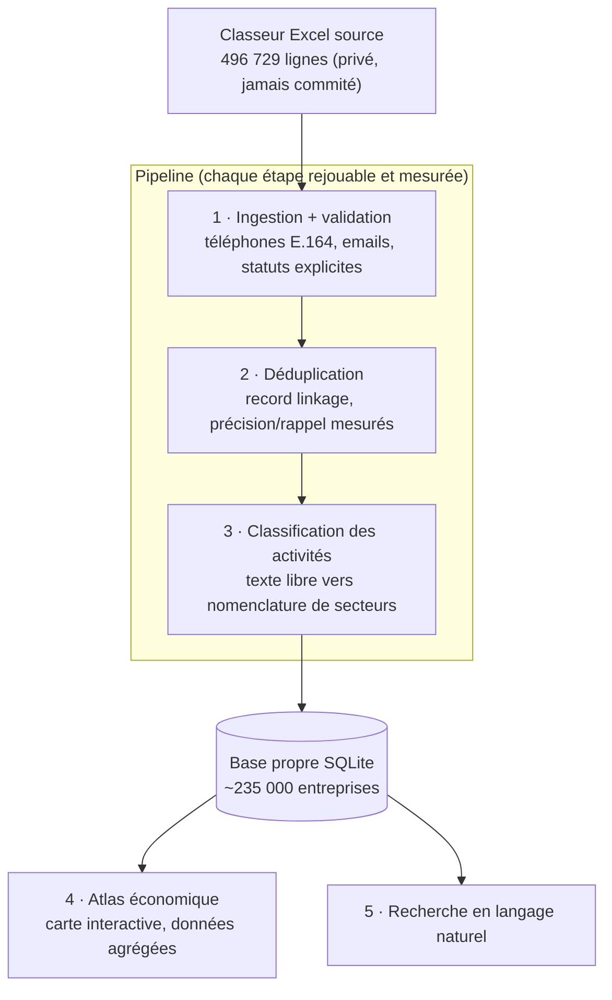

<div align="center">

# 🇧🇯 Annuaire Bénin

**L'annuaire national des entreprises du Bénin : 500 000 lignes brutes transformées en une base propre, mesurée et interrogeable.**

[](https://github.com/abiotov/annuaire-benin/actions/workflows/ci.yml)
[](https://www.python.org/)
[](LICENSE)
[](https://github.com/astral-sh/ruff)

*Documentation en français : le projet porte sur des données béninoises.*

</div>

---

Les annuaires d'entreprises d'Afrique de l'Ouest existent, mais à l'état brut : des exports Excel où la même société apparaît quatre fois, où l'activité est une phrase libre, où les numéros de téléphone mélangent deux plans de numérotation nationaux. Ce projet prend un tel export (celui du Bénin, environ 235 000 entreprises réelles) et le transforme, étape mesurée par étape mesurée, en une base exploitable : chaque conversion est comptée, chaque anomalie est qualifiée, chaque fusion sera prouvée.

## Les chiffres

| Mesure | Valeur |
|---|---:|
| Lignes brutes ingérées | 496 729 |
| Durée de l'ingestion complète | 50 s |
| Entreprises uniques estimées | ~235 000 |
| Téléphones convertis au plan 2024 (E.164) | 386 893 (77,9 %) |
| Numéros tronqués par l'export source, détectés et qualifiés | 109 780 (22,1 %) |
| Emails syntaxiquement valides | 99,7 % |
| Tests | 38, tous verts |

## L'anomalie qui valide l'approche

Le 30 novembre 2024, le Bénin est passé d'un plan de numérotation à 8 chiffres à un plan à 10 chiffres : chaque numéro existant a reçu le préfixe « 01 » ([communiqué ARCEP Bénin](https://arcep.bj/a-partir-de-30-novembre-2024-les-numeros-de-telephone-au-benin-passent-de-08-a-10-chiffres/)). Un numéro béninois complet fait donc aujourd'hui 10 chiffres : « 01 » suivi de l'ancien numéro.

Dans le fichier source, toutes les valeurs téléphone font exactement 8 caractères. Deux cas, deux traitements :

- **386 893 numéros (77,9 %)** sont des numéros de l'ancien plan (ils commencent par 2, 4, 5, 6 ou 9). Le pipeline ajoute le préfixe 01 : convertis, utilisables.
- **109 780 numéros (22,1 %)** commencent par « 01 » tout en ne faisant que 8 chiffres, alors qu'un numéro commençant par 01 doit en faire 10. Il leur manque les 2 derniers chiffres, coupés par l'outil qui a produit l'export (preuve : l'ancien plan n'autorisait aucun numéro commençant par 0, et le chiffre qui suit leur « 01 » reproduit exactement la distribution des mobiles de l'ancien plan). On ne peut pas deviner 2 chiffres manquants : le pipeline **garde la fiche** (nom, email, commune restent exploitables) et marque le numéro `suspect_01_court` au lieu de fabriquer un faux numéro.

Rien n'est supprimé : chaque ligne reste en base avec un statut qui dit exactement ce que vaut son téléphone. Un nettoyage naïf aurait « converti » ces 109 780 numéros en numéros faux ; c'est le principe du projet : **jamais de rejet silencieux, jamais de donnée inventée**. Détail de l'analyse dans [docs/donnees.md](docs/donnees.md).

## Architecture



Trois règles structurantes :

- **Chaque anomalie a un nom.** La normalisation ne retourne jamais un simple échec : `migre`, `deja_migre`, `zero_restaure`, `suspect_01_court`, `invalide`, `vide`. La qualité de la source se mesure au lieu de se subir.
- **Chaque étape produit des chiffres.** Taux de conversion, précision et rappel des fusions, taux d'erreur de classification : le README d'un pipeline de données doit se lire comme un rapport d'expérience.
- **Les données personnelles ne quittent jamais la machine.** Le dépôt publie le code, les métriques agrégées et des exemples fictifs ; le fichier source et `data/` sont exclus de git.

## État d'avancement

- [x] **Étape 1 : ingestion et validation.** Lecture des 9 onglets Excel, normalisation des téléphones vers E.164 (migration 2024, zéros de tête perdus, indicatifs pays, cellules multi-numéros) et des emails, chargement SQLite avec bilan chiffré. 496 729 lignes en 50 s.
- [ ] **Étape 2 : déduplication.** Dédup exacte SQL (53 % du fichier sont des copies strictes inter-onglets), puis record linkage : blocking multi-canaux, score de similarité, zone grise arbitrée par LLM et mesurée contre le baseline, clustering avec garde-fous anti sur-fusion. Jeu de vérité annoté à la main, précision et rappel publiés.
- [ ] **Étape 3 : classification des activités.** Le champ « activité » en texte libre vers une nomenclature de secteurs, taux d'erreur mesuré sur échantillon annoté.
- [ ] **Étape 4 : atlas économique.** Carte interactive et statistiques par commune, quartier et secteur, publiables car agrégées.
- [ ] **Étape 5 : recherche en langage naturel.** Interroger la base propre en français.

L'historique détaillé est dans [docs/journal.md](docs/journal.md).

## Structure du projet

```text
├── src/annuaire_benin/
│   ├── contacts/            # normalisation téléphones + emails (future lib PyPI autonome)
│   │   ├── phone.py         #   plan 2024, E.164, statuts explicites
│   │   └── emails.py        #   validation syntaxique, normalisation
│   └── ingest.py            # Excel -> SQLite, bilan chiffré par onglet et par statut
├── tests/                   # pytest, valeurs exclusivement fictives
├── docs/
│   ├── architecture.md      # choix techniques, cas de normalisation, confidentialité
│   ├── donnees.md           # dictionnaire des données, volumétrie, constats qualité
│   └── journal.md           # journal de bord du projet
└── .github/workflows/ci.yml # lint (ruff) + tests (pytest) sur chaque push
```

## Démarrage rapide

```bash
git clone https://github.com/abiotov/annuaire-benin.git
cd annuaire-benin
pip install -e ".[dev]"

pytest                # 38 tests
ruff check .          # lint

# Ingérer un classeur source vers SQLite
python -m annuaire_benin.ingest chemin/vers/source.xlsx --db data/annuaire.db
```

Sans le fichier source (privé), les tests et le code restent entièrement exécutables : ils n'en dépendent jamais. Un générateur d'échantillons synthétiques reproduisant les défauts de la source est prévu pour rendre le pipeline complet rejouable par n'importe qui.

## Confidentialité des données

La source contient des données personnelles (téléphones, emails de vraies entreprises). Règles absolues, vérifiées à chaque commit :

- le fichier source et le dossier `data/` ne sont jamais commités (`.gitignore`) ;
- aucune valeur réelle dans le code, les tests, les docs ou les messages de commit : les exemples utilisent des numéros non attribués et des domaines `example.*` ;
- seules des statistiques agrégées sont publiées.

## Décisions de conception

- **Pourquoi SQLite comme pivot :** un fichier unique, zéro serveur, requêtable par tout outil ; largement suffisant pour un demi-million de lignes.
- **Pourquoi des statuts plutôt qu'un booléen valide/invalide :** 22 % de la source est irrécupérable pour une raison précise ; la dire vaut mieux que la masquer.
- **Pourquoi `contacts/` est isolé :** aucune dépendance vers le reste du projet, API stable, tests exhaustifs ; le sous-paquet sera extrait et publié sur PyPI.
- **Pourquoi un jeu de vérité manuel avant la dédup :** un rapprochement sans précision ni rappel mesurés est une opinion, pas un résultat.

## Licence

[MIT](LICENSE)
