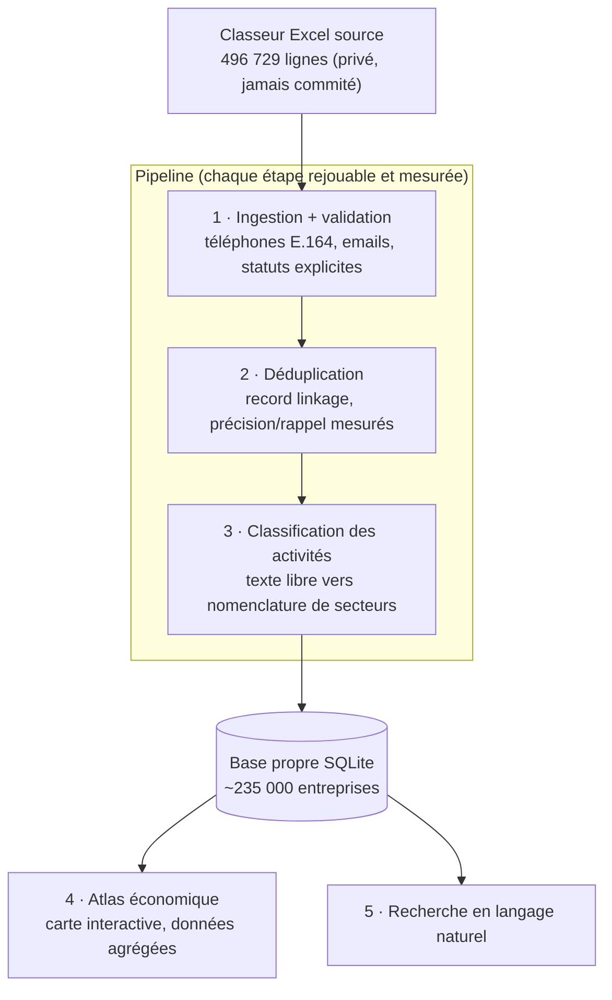

<div align="center">

# 🇧🇯 Annuaire Bénin

**L'annuaire national des entreprises du Bénin : 500 000 lignes brutes transformées en une base propre, mesurée et interrogeable.**

[](https://github.com/abiotov/annuaire-benin/actions/workflows/ci.yml)
[](https://www.python.org/)
[](LICENSE)
[](https://github.com/astral-sh/ruff)

*Documentation en français : le projet porte sur des données béninoises. [English summary](README.en.md).*

**[→ Voir l'atlas économique interactif](https://abiotov.github.io/annuaire-benin/atlas/)**

</div>

---

Les annuaires d'entreprises d'Afrique de l'Ouest existent, mais à l'état brut : des exports Excel où la même société apparaît quatre fois, où l'activité est une phrase libre, où les numéros de téléphone mélangent deux plans de numérotation nationaux. Ce projet prend un tel export (celui du Bénin, environ 235 000 entreprises réelles) et le transforme, étape mesurée par étape mesurée, en une base exploitable : chaque conversion est comptée, chaque anomalie est qualifiée, chaque fusion sera prouvée.

## Les chiffres

| Mesure | Valeur |
|---|---:|
| Lignes brutes ingérées | 496 729 |
| Durée de l'ingestion complète | 50 s |
| Entreprises uniques estimées | ~235 000 |
| Téléphones convertis au plan 2024 (E.164) | 386 893 (77,9 %) |
| Numéros tronqués par l'export source, détectés et qualifiés | 109 780 (22,1 %) |
| Emails syntaxiquement valides | 99,7 % |
| Entités après déduplication exacte | 235 360 (soit 53 % de copies inter-onglets) |
| Paires candidates au rapprochement flou | 280 377 (sur 27 milliards possibles) |
| Jeu de vérité annoté, complet | 420 paires (95 oui, 325 non) |
| Précision de la fusion automatique (mesurée sur le gold complet) | 83,1 % (contre 51,8 % avant calibration) |
| Fusions appliquées | 184 automatiques + 87 validées en revue |
| Entreprises finales après déduplication | 235 125 |
| Entités classées par secteur (25 secteurs) | 235 360 (100 %) |
| Entreprises localisées sur la carte (77 communes) | 235 022 (103 sans commune) |
| Tests | 68 unitaires + 2 smoke tests Playwright, tous verts |

## L'anomalie qui valide l'approche

Le 30 novembre 2024, le Bénin est passé d'un plan de numérotation à 8 chiffres à un plan à 10 chiffres : chaque numéro existant a reçu le préfixe « 01 » ([communiqué ARCEP Bénin](https://arcep.bj/a-partir-de-30-novembre-2024-les-numeros-de-telephone-au-benin-passent-de-08-a-10-chiffres/)). Un numéro béninois complet fait donc aujourd'hui 10 chiffres : « 01 » suivi de l'ancien numéro.

Dans le fichier source, toutes les valeurs téléphone font exactement 8 caractères. Deux cas, deux traitements :

- **386 893 numéros (77,9 %)** sont des numéros de l'ancien plan (ils commencent par 2, 4, 5, 6 ou 9). Le pipeline ajoute le préfixe 01 : convertis, utilisables.
- **109 780 numéros (22,1 %)** commencent par « 01 » tout en ne faisant que 8 chiffres, alors qu'un numéro commençant par 01 doit en faire 10. Il leur manque les 2 derniers chiffres, coupés par l'outil qui a produit l'export (preuve : l'ancien plan n'autorisait aucun numéro commençant par 0, et le chiffre qui suit leur « 01 » reproduit exactement la distribution des mobiles de l'ancien plan). On ne peut pas deviner 2 chiffres manquants : le pipeline **garde la fiche** (nom, email, commune restent exploitables) et marque le numéro `suspect_01_court` au lieu de fabriquer un faux numéro.

Rien n'est supprimé : chaque ligne reste en base avec un statut qui dit exactement ce que vaut son téléphone. Un nettoyage naïf aurait « converti » ces 109 780 numéros en numéros faux ; c'est le principe du projet : **jamais de rejet silencieux, jamais de donnée inventée**. Détail de l'analyse dans [docs/donnees.md](docs/donnees.md).

## Architecture



Trois règles structurantes :

- **Chaque anomalie a un nom.** La normalisation ne retourne jamais un simple échec : `migre`, `deja_migre`, `zero_restaure`, `suspect_01_court`, `invalide`, `vide`. La qualité de la source se mesure au lieu de se subir.
- **Chaque étape produit des chiffres.** Taux de conversion, précision et rappel des fusions, taux d'erreur de classification : le README d'un pipeline de données doit se lire comme un rapport d'expérience.
- **Les données personnelles ne quittent jamais la machine.** Le dépôt publie le code, les métriques agrégées et des exemples fictifs ; le fichier source et `data/` sont exclus de git.

## État d'avancement

- [x] **Étape 1 : ingestion et validation.** Lecture des 9 onglets Excel, normalisation des téléphones vers E.164 (migration 2024, zéros de tête perdus, indicatifs pays, cellules multi-numéros) et des emails, chargement SQLite avec bilan chiffré. 496 729 lignes en 50 s.
- [x] **Étape 2a : déduplication exacte.** Regroupement des copies strictes inter-onglets sur la clé (nom canonique, téléphone, email) : 496 729 lignes deviennent 235 360 entités en 56 s, chaque ligne brute reliée à son entité.
- [x] **Étape 2b : rapprochement flou.** Baseline livrée et **calibrée sur un jeu de vérité de 420 paires annotées** : blocking multi-canaux (280 377 paires candidates), score décomposé, clustering avec garde-fou. Le premier seuil de fusion (0,82) affichait 51,8 % de précision mesurée ; la courbe par bande de score a dicté le seuil 0,90, qui donne **82,5 % de précision pour 81 % de rappel** parmi les candidates. 184 fusions appliquées.
- [x] **Étape 2c : arbitrage LLM de la zone grise, mesuré puis... refusé.** Quatre configurations de juge Gemini évaluées contre le jeu de vérité avant tout déploiement (de 44 % à 71,4 % de précision selon le contre-examen adversarial, détail dans [docs/donnees.md](docs/donnees.md)). Aucune n'atteint un niveau déployable et l'échantillon de vraies paires grises est trop petit pour certifier un fusionneur : **décision documentée de ne pas fusionner automatiquement**. Les verdicts servent de pré-tri : les 1 500 meilleures paires grises sont arbitrées, et les 63 « même » confirmées passées en revue une à une (52 validées et fusionnées, 7 rejetées, 4 indécises). Savoir mesurer puis renoncer est aussi un résultat.
- [x] **Étape 3 : classification des activités.** Le profilage a révélé que le champ « activité » n'est pas du texte libre mais un vocabulaire fermé de **334 valeurs** : la classification devient une table de correspondance exhaustive, relue en entier, vers une taxonomie de 25 secteurs (`classify/mapping.csv`, auditable dans le repo). 235 360 entités classées, couverture 100 %, aucune valeur devinée. Le fine-tuning prévu n'avait plus d'objet : constater qu'un problème est plus simple que prévu fait aussi partie du travail.
- [x] **Étape 4 : atlas économique.** [Page interactive publiée](https://abiotov.github.io/annuaire-benin/atlas/) : choroplèthe des 77 communes **directement sur fond [OpenStreetMap](https://www.openstreetmap.org/)** (Leaflet vendorisé, zoom jusqu'à la rue, masque qui fait ressortir le pays), **trois métriques** (volume, [pour 1 000 habitants](https://abiotov.github.io/annuaire-benin/atlas/#mode=hab) sur les populations RGPH-4 2013 de l'INSAE, et [indice de spécialisation](https://abiotov.github.io/annuaire-benin/atlas/#mode=spec&s=agriculture-elevage-peche) en échelle divergente à seuils fixes), **[panorama des 25 secteurs](https://abiotov.github.io/annuaire-benin/atlas/#v=sectors)** en mini-cartes, comparateur de communes, top des quartiers par commune (agrégats), export CSV, vue tableau triable, liens partageables, encart méthodologique dans la page, favicon et aperçu Open Graph, thèmes clair et sombre. Zéro donnée individuelle, et un smoke test Playwright vérifie la page publiée dans la CI. Une vue 3D extrudée (MapLibre GL) a existé puis a été retirée sur décision produit : spectaculaire mais moins lisible que la choroplèthe.
- [x] **Étape 5 : recherche en langage naturel, en deux couches.** La barre de l'atlas comprend le français et la réponse **pilote la carte**. Couche 1, toujours disponible : un interpréteur embarqué (lexique de 414 mots-clés → secteur **dérivé automatiquement de la table de classification**, reconnaissance des 77 communes, grammaire d'intentions : compter, classer, profil, densité, spécialisation), testé en e2e dans la CI. Couche 2, pour la langue libre (« est-ce que Parakou a plus de restaurants que Bohicon ? ») : un **Worker Cloudflare** ([code dans `worker/`](worker/)) qui garde la clé Gemini en secret côté serveur (jamais dans la page), CORS restreint à l'atlas, débit limité par IP, et dont le LLM **ne fait que traduire la question en intention structurée** : les chiffres sont toujours calculés par la page depuis ses agrégats, une hallucination de nombre est architecturalement impossible. Chaque réponse passée par l'IA l'affiche en toutes lettres ; Worker muet ou hors ligne, la couche 1 reprend la main.

L'historique détaillé est dans [docs/journal.md](docs/journal.md).

## Structure du projet

```text
├── src/annuaire_benin/
│   ├── contacts/            # normalisation téléphones + emails (future lib PyPI autonome)
│   │   ├── phone.py         #   plan 2024, E.164, statuts explicites
│   │   └── emails.py        #   validation syntaxique, normalisation
│   └── ingest.py            # Excel -> SQLite, bilan chiffré par onglet et par statut
├── tests/                   # pytest, valeurs exclusivement fictives
├── docs/
│   ├── architecture.md      # choix techniques, cas de normalisation, confidentialité
│   ├── donnees.md           # dictionnaire des données, volumétrie, constats qualité
│   └── journal.md           # journal de bord du projet
└── .github/workflows/ci.yml # lint (ruff) + tests (pytest) sur chaque push
```

## Démarrage rapide

```bash
git clone https://github.com/abiotov/annuaire-benin.git
cd annuaire-benin
pip install -e ".[dev]"

pytest                # 38 tests
ruff check .          # lint

# Ingérer un classeur source vers SQLite
python -m annuaire_benin.ingest chemin/vers/source.xlsx --db data/annuaire.db
```

Sans le fichier source (privé), les tests et le code restent entièrement exécutables : ils n'en dépendent jamais. Un générateur d'échantillons synthétiques reproduisant les défauts de la source est prévu pour rendre le pipeline complet rejouable par n'importe qui.

## Confidentialité des données

La source contient des données personnelles (téléphones, emails de vraies entreprises). Règles absolues, vérifiées à chaque commit :

- le fichier source et le dossier `data/` ne sont jamais commités (`.gitignore`) ;
- aucune valeur réelle dans le code, les tests, les docs ou les messages de commit : les exemples utilisent des numéros non attribués et des domaines `example.*` ;
- seules des statistiques agrégées sont publiées.

## Décisions de conception

- **Pourquoi SQLite comme pivot :** un fichier unique, zéro serveur, requêtable par tout outil ; largement suffisant pour un demi-million de lignes.
- **Pourquoi des statuts plutôt qu'un booléen valide/invalide :** 22 % de la source est irrécupérable pour une raison précise ; la dire vaut mieux que la masquer.
- **Pourquoi `contacts/` est isolé :** aucune dépendance vers le reste du projet, API stable, tests exhaustifs. Le sous-paquet est extrait en bibliothèque autonome : [benin-contacts](https://github.com/abiotov/benin-contacts) (destinée à PyPI).
- **Pourquoi un jeu de vérité manuel avant la dédup :** un rapprochement sans précision ni rappel mesurés est une opinion, pas un résultat.
- **Pourquoi la carte n'affiche pas chaque entreprise individuellement :** le registre ne fournit aucune coordonnée GPS (seulement commune et quartier), et pointer des entreprises une à une publierait des données personnelles. L'atlas montre donc des densités par commune, sur une vraie carte navigable (fond OpenStreetMap, Leaflet vendorisé dans le repo : aucun CDN, tuiles chargées avec attribution, la page reste utilisable hors tuiles).
- **Fonctionnalités essayées puis retirées :** une météo Open-Meteo par commune (jolie mais sans valeur informative pour un atlas économique) ; OpenWeatherMap avait été écarté d'office, sa clé API serait exposée dans une page statique.

## Licence

[MIT](LICENSE)
